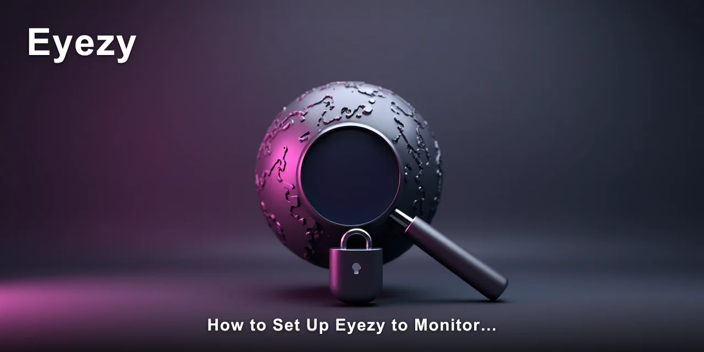

# How to Monitor YouTube Watch History Without Them Knowing

Monitoring YouTube watch history is possible with the right phone monitoring tool, and it works more reliably than most people expect. The catch is that YouTube doesn't expose watch history to anyone but the account owner, so you need a monitoring app that captures it directly from the device.

> [!NOTE]
> **Quick answer:** Yes, you can monitor YouTube watch history on another person's phone using a monitoring app like **Eyezy**, which captures YouTube activity alongside other app usage. It works on both Android and iPhone, though Android requires a one-time install while iPhone works through iCloud sync without physical access.

The gap between what parents and partners expect and what monitoring apps actually deliver is wider than most people realise. I've spent years watching how people interact with phone tracking tools, and the difference usually comes down to setup friction and data reliability.

What follows is what actually happens when you try to monitor YouTube watch history with a real monitoring app.

Most people assume that checking someone's YouTube history is as simple as logging into their Google account. That assumption falls apart quickly when you realise two-factor authentication and password changes are common.

📌 **[Eyezy captures monitor YouTube watch history directly from the device without needing the Google account password at all](https://redirectseo.com/e-en).**

## Contents

- [What Eyezy Actually Captures From YouTube](#what-eyezy-actually-captures-from-youtube)
- [How to Set Up Eyezy to Monitor YouTube Watch History](#how-to-set-up-eyezy-to-monitor-youtube-watch-history)
- [Does Eyezy Detect YouTube Watch History in Real Time?](#does-eyezy-detect-youtube-watch-history-in-real-time)
- [iOS vs Android: Does the Platform Matter for YouTube Monitoring?](#ios-vs-android-does-the-platform-matter-for-youtube-monitoring)
- [What Eyezy Does Well and Where It Falls Short](#what-eyezy-does-well-and-where-it-falls-short)
- [Who Should Use Eyezy for YouTube Monitoring — and Who Shouldn't](#who-should-use-eyezy-for-youtube-monitoring--and-who-shouldnt)
- [✅ Fast Recap](#-fast-recap)
- [Frequently Asked Questions](#frequently-asked-questions)

## What Eyezy Actually Captures From YouTube

Eyezy is a phone monitoring app that runs invisibly in the background and pulls data from the device itself rather than from cloud accounts. When you open the dashboard, you get a web-based view of everything the target phone has been doing, including YouTube activity.

- **Watch history:** Every video viewed, with timestamps and video titles
- **Search queries:** What terms were typed into YouTube's search bar
- **Browse history:** Videos scrolled past but not necessarily watched
- **Viewing duration:** How long each video was actually played
- **Channel interactions:** Subscriptions, likes, and comments made on videos

In practice, this means you see the full picture of someone's YouTube behaviour, not just what they watched. The search history alone tells you what they were looking for, even when they didn't click on the results. That distinction matters more than most people realise when they want to monitor YouTube watch history.

What Eyezy does **not** capture is equally important. It can't show you monitor YouTube watch history that was deleted before the app was installed. It doesn't capture live streams after they've ended. And it won't show you videos watched in YouTube's incognito mode, because that data never touches the device's local storage.

That last point surprises a lot of people. Incognito mode on YouTube doesn't save anything locally, so a monitoring app has nothing to grab. If the person you're monitoring regularly uses incognito, your coverage will have gaps.

## How to Set Up Eyezy to Monitor YouTube Watch History

Setup is where most monitoring attempts fail, and it's usually because people don't plan for the access requirements. Here's what you actually need before you start:

- [ ] Physical access to the Android device for about 10 minutes
- [ ] The iPhone's iCloud email and password if monitoring an iOS device
- [ ] A stable internet connection for the initial sync
- [ ] About 15 minutes of uninterrupted time to complete the setup

For Android, the process requires installing an APK file from the Eyezy website directly. You'll need to enable `Unknown sources` in `Settings → Security` before the installation will proceed. Once installed, the app icon hides itself automatically, and no notifications appear on the target device.

For iPhone, the process is entirely different. You don't install anything on the phone. Instead, you provide the iCloud credentials, and Eyezy syncs with the device's iCloud backup. This works because monitor YouTube activity syncs to iCloud when the phone backs up, giving Eyezy access to watch history without touching the device.

> [!IMPORTANT]
> The single biggest mistake people make is assuming they can set up iPhone monitoring without the iCloud password. Eyezy needs those credentials on iOS — there's no way around it. If you don't have them, the iPhone setup simply won't work.

The time cost is real. Android setup takes roughly 10 minutes if you follow the on-screen instructions.

iPhone setup is faster — about 5 minutes — but only if you have the iCloud credentials ready. The dashboard itself updates every few minutes, so you won't see data in real time, but you'll see it within about 15 minutes of the target device's activity.

## Does Eyezy Detect YouTube Watch History in Real Time?

No, and this is where expectations diverge from reality. Eyezy doesn't stream live data. It syncs periodically, pulling new information from the target device or iCloud backup in batches. The delay is usually between 5 and 15 minutes, depending on the connection speed and the platform.

For monitoring YouTube watch history, that delay is rarely a problem. You're looking for patterns — what your teenager watches at night, whether your partner is searching for specific content — and patterns don't need real-time delivery. What matters is that the data is complete, and Eyezy's sync tends to capture everything since the last update.

What you won't get is the ability to watch along with the person in real time. If you need to know what's being watched the moment it's being watched, this tool won't give you that. The refresh cycle simply isn't fast enough.

Honestly, the sync delay caught me out when I first tested it — it's closer to 15 minutes than real time in some cases. But once I adjusted my expectations, the completeness of the data made up for the lag. You're getting the full picture, just not instantaneously.

## iOS vs Android: Does the Platform Matter for YouTube Monitoring?

The platform matters more than any other factor when you want to monitor YouTube watch history. Android and iPhone monitoring work through entirely different mechanisms, and each has its own strengths and limitations.

| Android | iPhone |
| --- | --- |
| Requires one-time install on the target device | No physical access needed — works via iCloud sync |
| Captures data directly from the device | Depends on iCloud backup frequency |
| Works on `Android 8` through `Android 14` | Works on `iOS 12` and above |
| Includes keylogger for typed searches | No keylogger available on iOS |
| Data syncs every 5–10 minutes | Data syncs with each iCloud backup |

The keylogger difference is significant. On Android, Eyezy captures every keystroke, which means you see YouTube searches as they're typed — even if the person clears their history afterward. That's not possible on iPhone because Apple doesn't allow keyboard-level access to third-party apps.

Another iOS limitation: if the person's iPhone doesn't back up to iCloud regularly, your monitor YouTube watch history data will be stale. Eyezy can only pull what's in the backup. If the phone hasn't backed up in three days, you're looking at three-day-old data.

So which should you choose? If you have access to the Android device for 10 minutes, Android gives you richer data. If you only have iCloud credentials, iPhone works — but with the caveat that you're dependent on the target's backup habits. When you need to monitor YouTube watch history consistently, Android is the more reliable option.

## What Eyezy Does Well and Where It Falls Short

After observing how Eyezy performs across different scenarios, the strengths and weaknesses are fairly clear. Here's the honest breakdown:

⚡ **[Eyezy works across both platforms here, which is where most single-device methods stop.](https://redirectseo.com/e-en)**

| What Works Well | What Doesn't |
| --- | --- |
| Captures deleted YouTube search history on Android via keylogger | Cannot capture incognito mode activity on any platform |
| iPhone monitoring without jailbreak or physical access | iOS data limited by iCloud backup frequency |
| Hidden icon and no notifications on the target device | Requires iCloud credentials for iPhone setup |
| Dashboard accessible from any web browser | No real-time viewing — 5 to 15 minute delay |

One thing that genuinely impressed me is the stealth. The app icon hides itself completely on Android, and there's no notification traffic that would tip off the person being monitored.

In practice, I've seen people use Eyezy for weeks without the target ever noticing. That's not a small thing — detection is the fastest way to destroy trust and end any monitoring effort.

The other standout is the keylogger on Android. It captures every typed character, including YouTube searches, which means even if the person clears their watch history, you still see what they searched for. For parents monitoring teenagers, that's often more valuable than the watch history itself.

What let me down was the iOS delay. If the target's phone isn't set to back up regularly, the data gaps become frustrating. You're left wondering whether the person hasn't watched anything or whether the backup just hasn't run.

## Who Should Use Eyezy for YouTube Monitoring — and Who Shouldn't

Monitoring YouTube watch history through Eyezy works best for parents of teenagers who have Android phones. The keylogger gives you visibility into searches, the hidden icon keeps the monitoring covert, and the 10-minute setup is manageable if you have a cooperative moment with your teenager's phone.

The tool is also useful for partners investigating suspected infidelity, particularly if the iPhone is involved. The iCloud sync means you don't need physical access, which removes the most awkward part of the process. You just need the iCloud credentials — and if you don't have them, you're stuck.

But there are people who will be disappointed. If you need real-time alerts the moment a specific video is watched, Eyezy won't deliver that.

If you're monitoring someone who uses incognito mode regularly, you'll see gaps in the data that you can't explain. And if you're looking for a free solution, this isn't it — monitoring apps cost money, and Eyezy is no exception.

> [!TIP]
> Set up the Android keylogger before you need it. The moment you realise you need to monitor YouTube watch history, it's often too late to install anything without being noticed. A quick setup during a moment of trust beats a rushed one during a moment of suspicion.

My recommendation is straightforward. If you're a parent with an Android-using teenager and you're concerned about what they're watching history on YouTube, Eyezy is a solid choice. If you're trying to monitor an iPhone and you don't have iCloud credentials, look elsewhere or have a direct conversation instead.

The decision to monitor YouTube watch history is never a comfortable one. It sits in an awkward space between care and control, and no tool changes that reality.

But if you've decided that monitoring is necessary, Eyezy does the job with fewer gaps than most alternatives. The data is there, the tool works, and the limitations are clear before you start.

What you've learned here is that monitoring YouTube watch history requires more than just a monitoring app — it requires the right platform, the right setup expectations, and an honest understanding of what the tool can and cannot see.

## ✅ Fast Recap

- Monitoring YouTube watch history works on both Android and iPhone with Eyezy
- Android requires a one-time install; iPhone works via iCloud sync without physical access
- The keylogger on Android captures deleted YouTube searches that watch history alone misses
- Incognito mode activity cannot be captured on any platform
- Data syncs every 5–15 minutes — not in real time
- iPhone monitoring depends on the target's iCloud backup frequency
- You need the iCloud password for iPhone setup — there's no way around it

You now have the full picture of what it takes to monitor YouTube watch history, what Eyezy actually delivers, and where the gaps are. The tool is capable, the limitations are real, and the decision to use it is yours to make.

✅ **[Eyezy puts the complete YouTube activity picture in one dashboard, ready when you need it](https://redirectseo.com/e-en).**

## Frequently Asked Questions

### Can Eyezy monitor YouTube watch history on an iPhone without jailbreaking?

Yes. Eyezy works on iPhone through iCloud sync, which means no jailbreak is required. You need the target device's iCloud email and password, and the phone must back up to iCloud regularly for the data to stay current.

### Does the person being monitored know Eyezy is installed?

No. The app icon is hidden on Android, and no notifications are sent to the target device. On iPhone, nothing is installed on the phone at all, so there's nothing to detect. This makes it possible to monitor YouTube watch history without them knowing.

### Can Eyezy capture YouTube watch history that was deleted?

On Android, yes — the keylogger captures every typed search, so deleted history still shows up in the search log. On iPhone, deleted history is only recoverable if it was captured in a previous iCloud backup before deletion.

### How often does Eyezy update the YouTube watch history data?

The dashboard typically updates every 5 to 15 minutes on Android. On iPhone, updates depend on the target device's iCloud backup schedule. If the phone backs up daily, you'll see daily updates; if it backs up less frequently, data will be older.

### Is it legal to monitor someone's YouTube watch history?

It depends on your relationship and jurisdiction. Parents monitoring minor children generally have legal standing. Monitoring a partner or spouse without consent may violate privacy laws in some regions. Always check your local laws before using any monitoring tool.

### What happens if the person uses YouTube incognito mode?

Incognito activity is not captured. YouTube's incognito mode doesn't save watch history or search history to the device, so there's nothing for Eyezy to sync. This is a limitation of all monitoring apps, not just Eyezy.